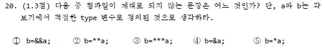

# 연산자 우선순위 (Order of operations)
> 친구 : 연산자 우선순위 외워라 키워드가 뭔지도 한번 보고 변수 이름 뭐되는지도 보고 (기출문제들이다)

## 우선순위
<ol>
  <li>`()` `[]` `->` `.` `::` : 그룹, 스코프, 배열/멤버 액세스</li>
  <li>`!` `~` `-` `+` `*` `&` `sizeof` <i>`type cast`</i> `++x` `--x` : 단항(unary)연산자, sizeof, type casts</li>
  <li>`*` `/` `%` : 곱셈/나눗셈/모듈러(나머지)</li>
  <li>`+` `-` : 덧셈/뺄셈</li>
  <li>`<<` `>>` : 시프트 연산자</li>
  <li>`<` `<=` `>` `>=` : 대소관계 비교연산자</li>
  <li>`==` `!=` : 이항 같음 연산자</li>
  <li>`&` : AND 연산자</li>
  <li>`^` : XOR 연산자</li>
  <li>`|` : OR 연산자</li>
  <li>`&&` : 논리 AND 연산자</li>
  <li>`||` : 논리 OR 연산자</li>
  <li>`?:` : 삼항연산자</li>
  <li>`=` `+=` `-=` `*=` `/=` `%=` `&=` `|=` `^=` `<<=` `>>=` : 할당연산자</li>
  <li>`,` : 쉼표</li>
</ol>

## 순서를 보면
`배열 같은 거 액세스에 필요한 거(생각해보면 당연함)` => `단항연산자, 타입` => `사칙연산` => `시프트연산자` => `대소관계` => `같음` => `비트연산` => `논리연산자` => `삼항연산자` => `할당연산자` => `쉼표`

각 연산자의 사용 용도를 생각하면서 그렇게 우선순위가 매겨진 이유를 생각하면 금방 외우거나 도출할 수 있을 것 같다.

KOI 2016 지역대회 중고등부 19번 문제에서도 우선순위 물어보는 문제가 나왔는데(우선순위가 가장 높은 연산자 찾기) 답이 `->` 였음

아니 너무 당연하잖아...

## 단항연산자란

- `! $x` : 단항연산자(unary operator)
- `$x + $y ` : 이항연산자(binary operator)

 
KOI 2016 지역대회 중고등부 20번 문제인데 답은 1번이다. 
아마 1번 빼고 다 단항연산자로 쓰일 수 있는 거라서 그런듯 
(애초에 논리 AND 연산자를 쓰는 게 말이 안되네)

- `*` : 포인터 연산자
- `&` : 참조 연산자

`**` 따위는 없으니까 `**a`라고 하면 a의 포인터의 포인터 그렇게 컴파일될 것인데 `&&a`라고 하면 a의 참조의 참조(?)일 텐데 그러면 논리 AND 연산자랑 겹쳐서 의도를 이해하지 못하고 컴파일 안되는 게 아닐지...

## 세미콜론은
`;`은 연산자가 아니다(KOI 2016 지역대회 중고등부 15번 문제).

## 참고

- https://ko.wikipedia.org/wiki/%EC%97%B0%EC%82%B0%EC%9D%98_%EC%9A%B0%EC%84%A0%EC%88%9C%EC%9C%84

- http://aero.sarang.net/blog/2008/01/perl-unary-operator.html
