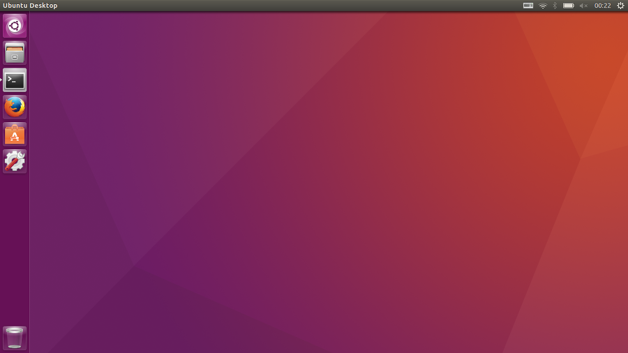

# Linux
운영체제 커널 <strong>리눅스(Linux Is Not UniX)</strong>에 관한 디렉토리.

# What is Linux?
리눅스는 리누스 베네딕트 토르발스(Linus Benedict Torvalds)가 만든 운영체제 커널이다. 이걸 GNU 프로젝트에서 완성시킨 게 GNU/Linux다.  
GNU를 잠깐 설명하자면, "리처드 메튜 스톨만" 이 개발한 하나의 운영체제이다. GNU는 <strong>Gnu's Not Unix!</strong>의 약자이다.  
<a href="https://ko.wikipedia.org/wiki/GNU"> (위키백과의 GNU 항목) </a>  
<a href="https://www.gnu.org/home.ko.html"> (GNU 공식 사이트) </a>    
~~갓~~리누스는 또 리눅스 커널관리를 위해서 git이라는 녀석도 만들었다. 이 프로젝트 역시 무료 git 저장소인 Github에 자리잡고 있다. 

# Distributions
리눅스 배포판은 그건 ~~파이썬 배포판처럼~~ 다른 응용프로그램들을 커널과 조합해서 배포되는 리눅스 운영체제를 말한다. 
우분투(데비안 기반), 페도라(RHEL 기반), 데비안, 아치, 칼리(데비안 기반), 크런치뱅(우분투 기반), 오픈수세(SUSE 기반), 리눅스 민트(우분투/데비안 기반) 등등이 있다.

# Use Linux?
 
> 필자가 얼마 전 노트북에 우분투를 깔고 찍은 스크린샷이다.

앵간하다. ~를 넘어서 편하다. 오히려 정보보안 공부 등에는 더 편하다. 한국어 지원 등도 잘 되어 있고 좋드아ㅏㅏ 
물론 Windows에서 Bash on Ubuntu on Windows ~~네이밍이 대단하죠?~~ 나 온라인 리눅스 터미널 ~~http://goorm.io 라던가~~ 을 사용해도 되겠지만 실제 리눅스가 최고다. 
근데 다른 일들 하다보면 Windows로만 구동되는 프로그램이 필요한 경우도 많고 하니까 좀 쓰다가 Windows 10으로 돌아왔다. Wine 같은 소프트웨어를 사용해서 Linux에서 Windows 프로그램을 실행할 수 있는 방법도 있긴 하지만... 
좀 정리되면 꼭 다시 리눅스로 가기로! ~~했는데 언제쯤?~~

# Installation

1. 설치할 배포판의 이미지 파일을 다운로드한다. 
2. 설치 USB 제작 툴을 이용하거나 이미지 파일을 마운트한 뒤 마운트된 가상 드라이브에 있는 파일을 USB에 옮기는 방식으로 설치 USB를 만든다. 
3. 바이오스의 부팅 장치 순서 설정을 이용해 USB에서 컴퓨터를 부팅한다. 
4. 나오는 과정대로 설치를 진행한다.

# Contents(예정)
뭐 일단 지금 바로 리눅스마스터 2급 자격증을 따야하는 상황이기 때문에(현재 1차 통과, 2차 시험 준비중) 해당 과정에 맞춰서 공부하게 될 것 같다. 
아래 두 과목에 걸쳐 문제가 출제된다.

-----
#### 리눅스 운영 및 관리
파일 시스템 관련 명령어, 쉘, 프로세스 관리, 에디터, 소프트웨어 설치, 장치 설정
#### 리눅스 활용
X 윈도, 인터넷 활용, 응용분야

-----
뭐 어차피 공부해야 되는 거니까 즐거운 마음으로 해보기로 하고... 그럼 스탙흐!
