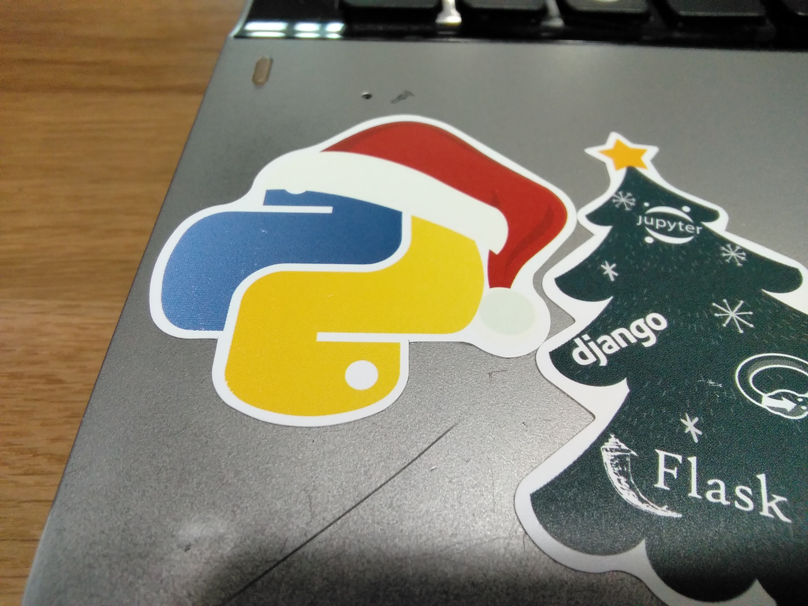

# Python
프로그래밍 언어인 <strong>파이썬(Python)</strong>에 대한 디렉토리

# What is Python?
파이썬은 어떠한 언어인지 살펴보자.</br>
파이썬 공식 홈페이지 : https://www.python.org/

# Introduce

#### 서론
먼저 파이썬이라고 하면 많은 사람들이 생각하는 게 ```와우~ 문법이 쉽~고 간~단해요!!```이다. 그리고 실제로 그렇다.</br>
실제로 전에 다니던 중학교는 정보시간에 라이트봇=>플레이봇=>스크래치 route를 밟았는데 쌤이 파이썬 어쩌고를 말했는데 실제로 파이썬 수업을 했을진 의문... 전학 가버려서 ~~안 한 것 같다~~ ~~애들이 라이트봇도 어려워하는데~~</br>
정보 하니까 생각나는데 그때 정보책에 파이썬은 교육의 목적으로 만들어졌다느니 교육용 프로그래밍 언어라느니 하면서 나오는데(다행히 정보쌤이 이걸 정정해서 말씀했다 bb), 사실은 걍 귀도 반 로섬(Guido van Rossum)이라는 분이 심심해서 취미로 만든 것이라고 한다.</br>
~~스스로 공부하기 위해서 만들었다고 저렇게 표기한 것인가..?~~</br>
아 그리고 인공지능, 빅데이터 처리 같은 스케일 큰 업무에도 쓰인다. 나는 인공지능 공부하면서 파이썬을 처음 알게 되었다.</br>
모 출판사의 이상한(?) 표기로 혼란이 온 사람이 있었다면 이 기회에 알고 갔으면...</br>

#### 우리 파이썬은요...!

- <strong>귀여워요!</strong> 로고도 비단뱀 모양이예요오! 근데 실제로는 좋아하는 코미디 그룹에서 이름 따서 지은 거예요오! 친구가 2017 파이썬 연말세미나에서 산타파이썬 스티커를 얻어와서 줬는데 너무 귀여워요오! ~~아니 산타모자 쓴 파이썬을 상상해보라고 심쿵이잖아 안그래?~~


- 아까도 밝혔듯이 <strong>문법이 쉽고 간단</strong>해서 배우기 쉽다.

- 지원하는 <strong>라이브러리, 프레임워크</strong>가 많다.

- 엄마야 거기다가 <strong>객체지향적</strong>이다. ~~이상형~~

- 또 머 어쩌고 저쩌고...

# Installing Python

##### Python version
Python2와 Python3 두 가지 버전이 공존한다.</br>
둘 다 많이 쓰이는데 서로 하위 호환성이 없으니 둘 다 이용하려면 따로 설치하던지 해야 한다. </br>
터미널에서 환경변수로 등록한 ~~나의 소중한~~ 파이썬이 무슨 버전인지 확인하려면 아래처럼 ```python --version```을 입력하면 된다.
```
C:\Users\JunhoYeo>python --version
Python 2.7.13
```
필자는 Python2다...

#### Python Distributions
파이썬은 여러가지 배포판이 있다.</br>
다른 언어처럼 파이썬에도 다양한 라이브러리가 있고, 외부라이브러리도 많은데 하나씩 다운받으면 귀찮으니까 개발에 필요한 라이브러리나 다른 모듈들이 하나로 모아서 배포되는 파이썬 프로그램이다.</br>
뭐 또 하나하나 다운받으라는 그 패키지 자체를 배포판이라고 하기도 하더라...

#### 배포판 종류
파이썬 공식 홈페이지에 있는 파이썬 배포판 목록 : https://wiki.python.org/moin/PythonDistributions</br>
사실상 아나콘다(Anaconda)가 가장 우세하지 않을까...</br>
아나콘다는 인공지능 개발이나 빅데이터 처리 그런 데 쓰이는 패키지를 모아놓은 배포판이다.

#### 설치
그냥 필요한 거 있으면 pip로 받거나 다운받아서 옮기고 하면서 받기로 하고 걍 파이썬 공홈에 있는거 다운받자.

##### Windows

1. Python 공홈 => Downloads에서 다운받을 버전의 Installer 다운로드 및 실행하여 설치
2. 설정 들어가서 Terminal 환경변수까지 세팅해두면 끝 (근데 요즘은 Installer가 자동으로 해주나봄)
3. Python IDE나 Text editor 설치
4. 끝났다 놀즈아

##### Linux
```
sudo apt-get install python3.6
```
등을 이용하여 업데이트(기본으로 설치되어 있을 것이다)

#### Mac
제게 맥북을 사드리면 알려드리지요.

# Finished!
이제 설치완료임 ㅊㅋ 열심히 하면됨 ㅅㄱ

# 목char(대충 예정임)
1. HelloWorld : 출력문에 대해 배운다
2. Interpreter : 인터프리터에 대해서 배우고 뭐 다른 유용한 팁들
3. Data : 변수, 연산, 자료형, 리스트, 사전~~여기에 몰빵하는걸루~~
4. Statements : if, elif, else, for, while 뭐 그런 조건문, 루프문 그런거 ㅇㅇ
5. Function : 함수 어쩌고 정리
6. Object-oriented : 객체지향, 클래스 뭐 그런거

## Special thanks to...
나를 파이썬의 세계로 전도한 강모씨 ~~어우 수고했어~~
