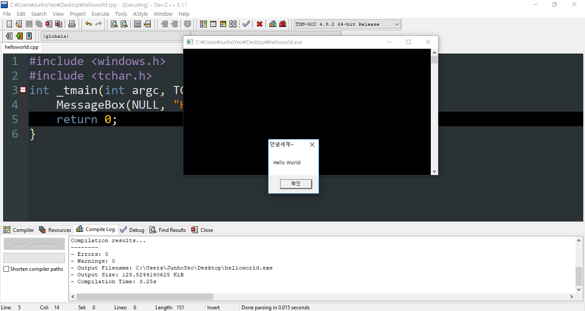

## 1-1. 기초 리버싱 - 리버싱 스토리

### 리버스 엔지니어링
리버스 엔지니어링(역공학) : 시스템 등의 구조, 기능, 동작 분석 -> 원리 이해, 단점 보완, 아이디어 추가

리버스 코드 엔지니어링 : 소프트웨어 분야의 리버스 엔지니어링

### 실행파일 분석 방법
- 정적 분석
- 동적 분석

정적 분석으로 정보 수집 -> 구조와 동작 원리 예측 -> 동적 분석에 아이디어 제공

두 가지 방법을 활용 -> 리버싱 시간 단축, 효과적인 분석

디버깅은 리버싱의 하위 개념

#### 정적 분석
파일의 겉모습을 관찰하여 분석하는 방법 -> 파일 실행 x

파일의 종류, 크기, 헤더(PE) 정보, API, 내부 문자열, 실행 압축 정보, 등록/디버깅 정보 등의 내용 확인

디스어셈블러를 이용해서 내부 코드와 그 구조를 확인하는 것

정적 분석을 통해 얻어낸 정보 -> 동적 분석 방법의 참고자료로 활용 가능

#### 동적 분석
파일을 직접 실행시켜서 행위분석, 디버깅 통해 흐름과 메모리 분석

파일, 레지스트리, 네트워크를 관찰하며 행위분석

디버거를 이용해서 프로그램 내부 구조와 동작 원리 분석

### 소스코드, 헥스코드, 어셈블리 코드
리버싱에서 취급하는 대상은 보통 실행 파일 -> 소스코드 없이 실행 파일의 바이너리 자체를 분석

소스코드와 바이너리 코드 사이의 관계 -> 리버싱 이해에 도움

```c++
#include <windows.h>
#include <tchar.h>
int _tmain(int argc, TCHAR *argv[]){
	MessageBox(NULL, "Hello World!", "안녕세계~", MB_OK);
	return 0;
}
```
책에 나온 코드를 참고하여 저렇게 WinAPI를 이용한 C++ HelloWorld를 짜봄

책에서는 Visual C++를 권장하나 Dev C++로 해버리기(헿)

<br>


실행결과 교재와 동일하게 나옴

#### 헥스코드
생성된 실행파일은 바이너리(이진) 형식

2진수를 16진수로 변환시켜 훨씬 보기 수월해짐 -> 헥스 에디터(HxD 등)

#### 어셈블리 코드
좀 더 사람이 이해하기 쉬운 어셈블리 코드 형태 -> 디버거를 이용

헥스코드를 디스어셈블 과정을 거쳐서 어셈블리 코드로 변환해 보여줌

### 패치와 크랙
패치 : 프로그램의 파일 혹은 실행 중인 프로세스 메모리의 내용을 변경하는 작업 -> 취약점 수정, 기능 개선

크랙 : 패치와 같은 개념 + 비합법적 / 비도덕적 -> 저작권 침해 등

### 리버싱 준비물
목표, 열정, 구글

### 리버싱 방해물
과욕, 조급함

### 리버싱 묘미
동작원리, 내부구조 분석해서 하나씩 알아가는 것
